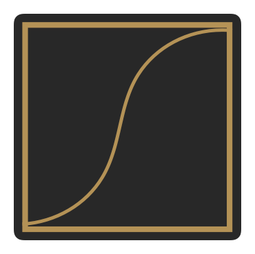
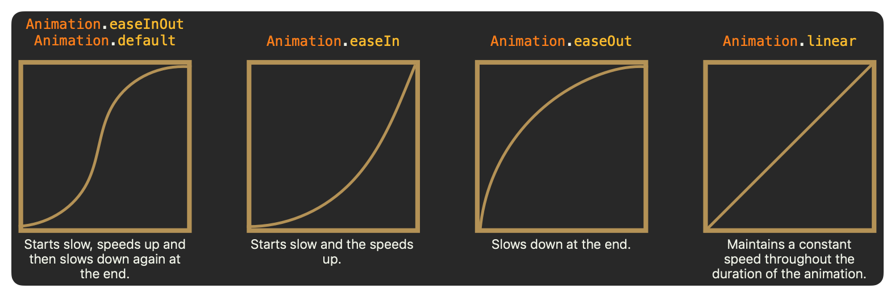

# SwiftUI Animations

SwiftUI provides a wide range of animations that we can use to bring your app to life. These animations can be used to create dynamic and engaging user interfaces. In this guide, we will explore the different types of animations available in SwiftUI and learn how to use them effectively.

## Getting Started

The word "animation" comes from the Latin word "animare," which means to move or change. In SwiftUI, animations are used to create the illusion of movement or change in our app's user interface.

### Parts of an Animation

An animation consists of three main parts:

1. `Start` – This is the beginning state of the view.
2. `Change` – This is where the animation happens.
3. `End` – This is the final state of the view.

Let's take a look at an example of an animation:

```swift
struct PartsOfAnimation: View {
    @State private var isAnimating: Bool = false

    var body: some View {
        VStack {
            Circle()
                .fill(.blue)
                .frame(width: 100, height: 100)
                .offset(y: isAnimating ? 300 : 0) // 2. (2)
                .animation(.easeInOut, value: isAnimating) // 3. (3)

            Spacer()

            Button("Start Animation") {
                isAnimating.toggle() // 1. (1)
            }
            .buttonStyle(.bordered)
        }
    }
}
```

1. The button triggers a variable's value to change.
2. The variable's value changing causes the `Circle` Y position to change.
3. Animate the change between the start and end states.

In this example, we have a `Circle` view that is initially positioned at the top of the screen. When the user taps the "Start Animation" button, the `isAnimating` variable is toggled, causing the `Circle` to move down the screen.

<figure markdown="span">
    
</figure>

!!! info "What else can be animated?"
    Most, if not all, of the properties that can be animated have a numerical value. For example, the `opacity`, `scale`, and `rotation` properties can be animated.

## Animation Curves

An animation curve is a way to describe the speed through the duration of an animation. In the previous example, we used the `easeInOut` curve to animate the `Circle` view. Graphically, the curve looks like this:

<figure markdown="span">
    { align=left width=200 }
    <figcaption>The easeInOut curve</figcaption>
</figure>

!!! note
    The `easeInOut` means that the animation starts slowly(easeIn), and then speeds up, and then slows down again(easeIn).

There are several other animation curves available in SwiftUI

- `easeInOut` | `.default`: Starts slow, speeds up and then slows down again at the end.
- `easeIn`: Starts slow and the speeds up.
- `easeOut`: Slows down at the end.
- `linear`: Maintains a constant speed throughout the duration of the animation.
- `spring`: Creates a springy effect.

<figure markdown="span">
    
    <figcaption>Animation curves</figcaption>
</figure>

Let’s look at examples of each curve. The duration is set to 2 seconds.

<figure markdown="span">
    
</figure>

??? example "Show example code"
    ```swift title="TextView.swift"
    --8<-- "docs/assets/code/swiftui/SwiftUIPG/SwiftUIPG/ContinuedLearning/SwiftUIAnimations/AnimationCurves.swift"
    ```
